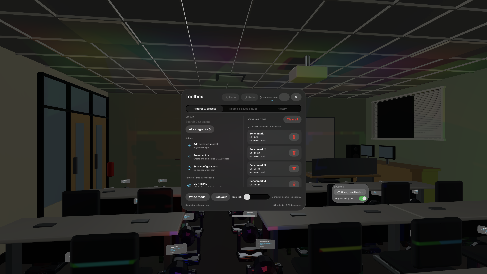
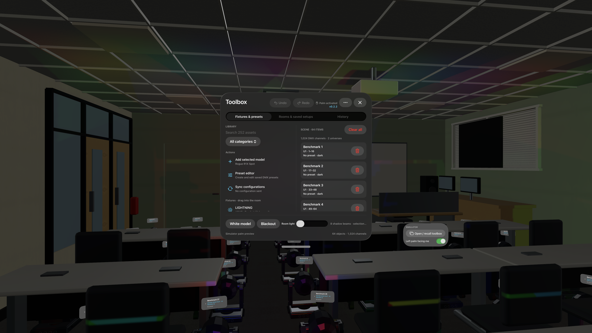

# Mac comparison — original classroom and mappedRoom

Date: 2026-10-03. Source: `origin/dev` **d8e6f13e568add6a74b32114c88aa45275a93321**, tagged **v0.2.2**. Work: `agent/mapped-room-native-validation`, `.worktree/mapped-room-native-validation`.

**Native compilation, both room imports, all six mapped textures, and Simulator static/moving workloads passed. Physical headset performance is not tested.** Chris’s Vision Pro remained unavailable. The Mac was locked, blocking direct UI interaction. Automated native checks exercise application commands and RealityKit imports/collisions; they do not establish wearer acceptance.

## Environment and checkout

- macOS 27.0.1 (26A434), Xcode 27.0 (27A266a), Apple Swift 6.4 (swiftlang-6.4.0.34.1).
- Successful runtime: visionOS 26.5 (23O470), Apple Vision Pro Simulator `288D6CFE-09D9-422B-96A0-53081DA29C44`.
- Additional attempt: visionOS 27.0 (24M362), Simulator `37FB51A4-DFF5-40C0-BFE1-32F8AA69EE4F`. Boot remained at “Waiting on System App”; installation/launch did not finish during a roughly four-minute wait. Those commands were interrupted and that Simulator shut down. No visionOS 27 runtime pass is claimed. [Boot evidence](2026-10-03-mapped-room/evidence/sim27-boot.log).
- Physical target: Chris’s Apple Vision Pro `00008112-001619923CC1A01E`, reported **unavailable** by repeated `xcrun devicectl list devices`. [Device evidence](2026-10-03-mapped-room/evidence/device-status.txt).
- Debug Simulator and unsigned Release device bundles both report `CFBundleShortVersionString = 0.2.2`. [Host record](2026-10-03-mapped-room/evidence/host.txt), [release version check](2026-10-03-mapped-room/evidence/version-check.log).

Read `AGENTS.md`, `README.md`, `docs/VALIDATION.md`, `docs/MAPPED_ROOM_LIGHTING.md`, and `apps/room2blender/mappedRoom/README.md`. Pulled dev by fetching its current remote ref and fast-forwarding. Preserved/restored the primary checkout’s existing Xcode project edits with a path-specific stash. Created the assigned worktree from current dev; all edits, builds and tests ran there. No master changes, release bump, integration or push in this task.

```sh
# Primary checkout; existing Xcode edits temporarily stashed/restored around merge.
git -c credential.helper='!gh auth git-credential' fetch \
  https://github.com/reactivepixel/venueVolume.git dev:refs/remotes/origin/dev --tags
git merge --ff-only origin/dev
git worktree add -b agent/mapped-room-native-validation \
  .worktree/mapped-room-native-validation dev
```

## Compilation and regression results

Commands below ran from the assigned worktree’s `apps/visionos` unless otherwise indicated.

```sh
swift test --package-path Core
./scripts/test-session.sh
python3 Tests/verify-assets.py
xcodebuild -project VenueVolume.xcodeproj -scheme VenueVolume \
  -destination 'generic/platform=visionOS Simulator' \
  -derivedDataPath DerivedData CODE_SIGNING_ALLOWED=NO build
xcodebuild -project VenueVolume.xcodeproj -scheme VenueVolume \
  -configuration Release -destination 'generic/platform=visionOS' \
  -derivedDataPath DerivedData-device CODE_SIGNING_ALLOWED=NO build
/usr/libexec/PlistBuddy -c 'Print CFBundleShortVersionString' \
  'DerivedData/Build/Products/Debug-xrsimulator/Venue Volume.app/Info.plist'
/usr/libexec/PlistBuddy -c 'Print CFBundleShortVersionString' \
  'DerivedData-device/Build/Products/Release-xros/Venue Volume.app/Info.plist'
# Worktree root:
python3 apps/visionos/scripts/check-version.py --release
python3.14 research/fixtures/test_expansion_pipeline.py
```

| Check | Outcome | Evidence |
| --- | --- | --- |
| Core | 49 tests passed | [Log](2026-10-03-mapped-room/evidence/core.log) |
| Session | All six groups passed: session, rooms, mapped-room upgrade/history, audit, interaction, catalog | [Log](2026-10-03-mapped-room/evidence/session.log) |
| Bundles | Exact classroom/pilot bytes, 252 catalog models/rigs, mapped-room bytes and geometry/interaction parity passed | [Log](2026-10-03-mapped-room/evidence/assets.log) |
| Debug Simulator build | Passed, including new native import regression harness | [Log](2026-10-03-mapped-room/evidence/sim-build.log) |
| Unsigned Release device build | Passed initially and after final source change; not a signed install or device run | [Final log](2026-10-03-mapped-room/evidence/device-build-final.log) |
| Version settings/built bundles | Both 0.2.2; release check passed on base release HEAD | [Log](2026-10-03-mapped-room/evidence/version-check.log) |
| Pipeline regressions | 13 passed on Homebrew Python 3.14.7 | [Log](2026-10-03-mapped-room/evidence/pipeline-tests-python314.log) |

The first pipeline-test attempt used Apple Python 3.9.6 and stopped at an existing nested f-string syntax incompatibility before tests ran. Re-running on installed Python 3.14.7 passed; no source workaround was made. [Initial error](2026-10-03-mapped-room/evidence/pipeline-tests.log). Xcode’s App Intents metadata warning about the absent framework did not fail either build.

## Native room/material import

Added Debug-only `--room-import-smoke` in `VenueScene`. This inspects the actual RealityKit `ModelComponent` materials **before** White model overrides. It fails room loading with `ROOM_IMPORT_SMOKE_FAIL` if the expected mesh/material/texture bindings differ, and emits structured `ROOM_IMPORT_SMOKE_PASS` evidence on success. Normal launches and Release builds do not run it.

| Imported property | Original classroom | mappedRoom |
| --- | --- | --- |
| Room ID | img3153-classroom-v1 | mappedRoom |
| Model components | 68 | 68 |
| Material type/blending | Opaque PBR throughout | Opaque PBR throughout |
| Unique base-color textures | 0 | 6 |
| Native texture sizes/mips | None | Two 512×512 with 10 levels; four 256×256 with 9 levels |
| Textured entity/material bindings | 0 | 23 |
| Asset SHA-256 | d2fe021e211a4fb5f7d98fdb774ad452d60d95484e2e3b7a27e9cdfaba4f4e26 | 898898a1ee75dce5fac319974ce533ddc15c48db69b98cbc40367679770f9655 |

[Original import bindings](2026-10-03-mapped-room/evidence/baseline-import.log), [mapped import bindings and final static workload](2026-10-03-mapped-room/evidence/mapped-static-final.log). The verifier confirmed unchanged 18,744-triangle geometry, 96 colliders, 11 placement surfaces, bounds and spawn. These assets required no repair. Binding success is stronger evidence than merely finding six PNG entries inside a USDZ, but it does not replace close visual review of every surface on headset.

## Simulator A/B workload

Installed the newly built Debug app. Used `simctl` directly to capture a PTY console; these are the underlying install/launch paths used by `run-demo.sh`. Benchmark arguments themselves enable isolated demo state. Normal presets, placements and history were not reset.

```sh
VV_SIMULATOR_ID=288D6CFE-09D9-422B-96A0-53081DA29C44
xcrun simctl install "$VV_SIMULATOR_ID" \
  'DerivedData/Build/Products/Debug-xrsimulator/Venue Volume.app'
# Each combination ran separately, waiting for its JSON before the next launch.
for VV_ROOM in baseline mappedRoom; do
  xcrun simctl launch --terminate-running-process --console-pty "$VV_SIMULATOR_ID" \
    com.venuevolume.VenueVolume --lighting-benchmark="$VV_ROOM" \
    --benchmark-lights=8 --benchmark-seconds=30 --room-import-smoke \
    -ApplePersistenceIgnoreState YES
done
# Same two launches repeated with --benchmark-motion.
```

The loop expresses the two separately issued commands; console launch blocks until app termination, so the next run was started from another shell after completion. Early `--console` output buffering was avoided with `--console-pty`. Initial samples overlapped compilation and were not used for the final comparison. mappedRoom’s static workload was repeated with the same presentation flags as baseline.

All four final reports show 64 fixture objects, eight requested/allocated shadow components, material mode (`whiteRoom=false`), room light 0.05, nominal Simulator thermal state and approximately 30 measured seconds after the five-second warmup. Fixed UUIDs, poses and fixture count are supplied by the existing benchmark.

| Workload | Light component writes including warmup | Joint transform writes including warmup | Report |
| --- | --- | --- | --- |
| Original static | 8 | 128 | [JSON](2026-10-03-mapped-room/evidence/baseline-8-static.json) |
| mappedRoom static | 8 | 128 | [JSON](2026-10-03-mapped-room/evidence/mappedRoom-8-static.json) |
| Original moving | 8 | 336,049 | [JSON](2026-10-03-mapped-room/evidence/baseline-8-moving.json) |
| mappedRoom moving | 8 | 336,532 | [JSON](2026-10-03-mapped-room/evidence/mappedRoom-8-moving.json) |

Static joint counts stayed at the initial 128; moving runs changed rig transforms without rewriting unchanged light components. Native recording frames show changing head orientations and colored illumination across furniture/walls/ceiling. The central Toolbox obscures part of the view, and the dense fixture grid intersects furniture as the runbook describes. The six small textures are subtle at this distance; these images cannot establish texture fidelity or count eight distinct visible beams.

**No performance winner or increased beam limit is established.** `SceneEvents.Update` cadence is a diagnostic, not displayed FPS or GPU time; both fields remain null. Simulator stalls appear in the raw reports. No RealityKit Trace, compositor deadline, measured texture residency or physical thermal result was obtained. The default remains eight.

Original classroom:



mappedRoom:



[Native moving-light recording](2026-10-03-mapped-room/evidence/mapped-room-motion.mp4). Captured with `xcrun simctl io "$VV_SIMULATOR_ID" recordVideo --codec=h264`; the archived review clip is a 15-second excerpt, resized to 1920 pixels wide using FFmpeg (`-ss 5 -t 15 -vf scale=1920:-2 -c:v libx264 -crf 28`). It is a native app render, not a mockup or gesture recording.

## Catalog, history and native input checks

```sh
# Issued separately with --console-pty and individual captured logs:
xcrun simctl launch --terminate-running-process --console-pty "$VV_SIMULATOR_ID" \
  com.venuevolume.VenueVolume --demo --blue --catalog-smoke --room-import-smoke \
  -ApplePersistenceIgnoreState YES
# Repeated, replacing --catalog-smoke with --history-smoke, then --input-smoke.
```

- **252 distinct `CATALOG_RIG_PASS` markers and `CATALOG_SMOKE_PASS assets=252`**, no failure marker. Each real USDZ loaded into RealityKit, constructed its rig and checked emitter poses at joint bytes 128, 0, 255, 128. [Full log](2026-10-03-mapped-room/evidence/catalog-smoke.log).
- **`ROOM_LIBRARY_SMOKE_PASS` and `AUDIT_HISTORY_SMOKE_PASS`**. Real room import/switch/save paths, synthetic scanned-mesh placement, target preview/save, saved pose reopening, axis rotation with preserved DMX, Undo/Redo and cross-room restoration passed. Synthetic mesh replay is not live scanning. [Log](2026-10-03-mapped-room/evidence/history-smoke.log).
- **`TOOLBOX_WINDOW_SMOKE_PASS` and `SPATIAL_INPUT_SMOKE_PASS`**. Native window close/reopen/recall callbacks and rendered collision/input routing passed. No gaze/pinch gesture was performed. [Log](2026-10-03-mapped-room/evidence/input-smoke.log).

Recorded scoped `native_validation=passed` with source commit, platform, checks and evidence on exactly those 252 rig records, plus the rollout summary. Synchronized the CSV native-animation states, then ran `python3 research/fixtures/publish_pipeline_status.py` and re-ran the asset verifier. Pipeline totals are **243 complete, nine visual_review_pending, 71 blocked** across 323 rows. Existing visual findings and blocked-row errors remain. “Complete” is the publisher’s structural/native-import category; the attached evidence explicitly excludes reference fidelity, physical gestures and headset performance. No USDZ, manufacturer geometry or control profile changed.

## Remaining acceptance

**Physical device: NOT TESTED.** The wearer was asked to connect/wear/unlock Chris’s headset and unlock the Mac; no readiness confirmation arrived, and the physical device remained unavailable. Unsigned device compilation is not hardware validation.

Still required on a worn headset, using Release and RealityKit Trace as specified in [the lighting runbook](../MAPPED_ROOM_LIGHTING.md):

1. Both rooms at 0/1/2/4/8/16/32/64 requested shadow beams, static/moving, three alternating-order repeats; verify actual visible contributions and shadows rather than allocation alone.
2. App CPU/GPU timing, compositor misses, current refresh deadline, measured memory/texture residency, loading, and ten-minute thermal soak of the highest passing candidate in each room. Hardware-gated expanded counts and physical thermal reduction/recovery remain untested.
3. Walking/look-around shadow/occlusion correctness, texture fidelity, tracking alignment, hand interaction and comfort. Selection priority, multi-emitter and blackout policy have model-level coverage; their physical rendering acceptance remains open.
4. Existing normal installation’s old-history upgrade, mappedRoom visibility and saved material/setup restoration through real UI/relaunch. Session tests passed these state rules; isolated benchmark/demo launches do not complete this manual acceptance.
5. Live World Sensing scan, save/reopen, fixture placement/targeting on captured surfaces and relaunch persistence. Representative manufacturer-reference visual review and the nine flagged assets remain open.
6. Retry visionOS 27 Simulator import after its System App starts normally; current native runtime evidence is limited to 26.5.

Console/build log line endings are normalized to LF and trailing whitespace is stripped for review; message content is preserved. Evidence is committed alongside this report; `/tmp` recordings/logs alone are not the handoff. The validation branch/worktree is retained for review and later hardware testing.
