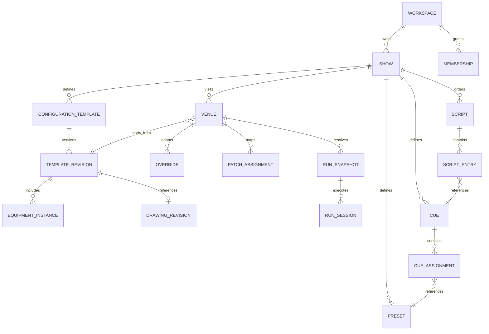

# Domain Model

The founder-confirmed domain is recorded in [[../02 Product/Features/Feature Catalog|Feature Catalog]]. Stable IDs, revision policies, and exact resolution semantics here are engineering proposals for that domain.

## Ownership



A venue may initially have no selected template (draft/incomplete). The diagram shows the configured state. A show can have many configurations and venues. No fixed venue count is part of the domain.

## Identity and revision

Every aggregate has a stable ID, workspace ID, owning show ID where applicable, schema version, revision, creation/update metadata, and lifecycle status. Relationships use IDs, never editable names or array positions. Published revisions are immutable; subsequent changes create a draft. Logical fixture IDs survive moving or repatching equipment.

Inventory lines may represent quantities of non-addressable items. Independently addressable fixtures have separate instance IDs even when they share a profile. A fixture profile revision and selected mode determine its DMX footprint. A role such as `upstage-wash` maps to a venue-specific set of instances.

## Two inheritance paths

Configuration resolves from the pinned template drawing and inventory plus venue structural changes. Programming resolves from show presets/cues/scripts plus venue programming overrides. Do not force templates into the precedence chain for every cue parameter.

```text
Template revision (drawing + inventory) ──> venue structural overrides ─┐
Show programming (presets + cues + scripts) ─> venue program overrides ─┼─> resolved venue snapshot
Fixture profile revisions + role bindings + venue patch/output routes ┘
```

For a scalar field: if a venue override exists, use it, even if its value is `0`, `false`, or an allowed explicit null. Otherwise use the inherited source. Reset removes the override record; setting it to zero does not reset it. Every resolved field reports source entity, source revision, and field path.

Collections use stable IDs. Venue equipment removal is a tombstone against the base item. Additions receive new IDs. Script entries have their own IDs, including repeated references to one cue. Initial proposal: a venue sequence override replaces the ordered entry list as one revisioned value; it is not merged by array index.

## Upstream adoption

Venues pin template revisions. When a new revision appears, compare base B, local venue L, and upstream U. Unchanged local fields may adopt U; local-only changes remain local; competing changes require an explicit choice. Removed referenced equipment, changed footprints, and missing capabilities block successful compilation. Rebase/adoption is transactional and never updates an active run.

## Live-operation extension

Runtime adds temporary manual programmer values, group/grand masters, song IDs, expected entry offsets, venue MIDI mappings, and a call log keyed by occurrence and playback pass. Selected fixtures, inspected cue, and active cue are separate. Restart reapplies an entry and resets current-pass markers from there without deleting history. See [[../02 Product/Features/F16 - Workflow modes and live programmer]] and [[../02 Product/Features/F17 - Script transport and MIDI triggers]].

Accepted live edits advance an explicit runtime revision for future calls while retaining the active look and manual values. Structural fixture/patch changes require a validated disarmed transition. [[../02 Product/Features/F18 - Persistent console and live updates]] distinguishes draft arrival from application without reload.

## Cue semantics

A cue is a named state definition and transition policy. Assignments bind a preset to a role, group, or instance; venue resolution supplies actual targets and parameter values. A script is an ordered list of references to those definitions. Activating Q02 and advancing to the script's next entry are different commands.

Initial proposed evaluator: compute complete resolved states without implicit tracking. Assignments own explicit included parameters; unowned parameters resolve to the configured baseline. Conflicting assignments must be rejected or resolved by an explicit priority policy. Fade interruption, blackout behavior, and discrete channel timing need validated engine decisions before physical use.

## Worked example

Show `Afterglow` defines `Midnight blue` at 75% intensity. `The Glasshouse` overrides it to 60%; `Mercury Hall` has no override and receives 75%. Q02 assigns this preset to `upstage-wash`. The Glasshouse maps that role to four local wash instances and its own patch. A script can reference Q02 twice with different entry notes. Resetting the Glasshouse override restores 75%; changing the show default later propagates at the next resolved draft publication, never mid-run.

## Integrity checks

- Every reference belongs to the authorized workspace/show or an explicitly shared immutable library.
- All required profiles/assets and role mappings are available before compilation.
- Quantities and geometry units are valid; patch footprints fit and do not collide.
- A preset's required capabilities are supported by each target or a reviewed fallback.
- Cue/script references cannot dangle; deleting an entity reports dependents.
- A run snapshot contains exact revisions and a content hash. Cloud draft edits cannot mutate it.
