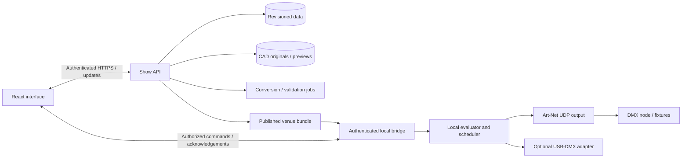

# Service and Runtime Boundaries

## Proposed architecture

React is the SaaS user interface. Cloud services own identity, collaboration, revisioned show data, assets, and entitlement metadata. A venue-local bridge is proposed for physical output, local timing, and runtime continuity. These are responsibility boundaries; they do not yet require separate deployed microservices.

The delivery path between a hosted browser and local bridge needs an R&D decision covering browser transport restrictions, authentication, origin checks, local network permissions, and offline entry. A desktop companion UI is an option. Do not assume an arbitrary hosted page can connect to an unauthenticated LAN socket.

## Responsibilities by surface

| Surface | Responsibilities | Must not assume |
| --- | --- | --- |
| React UI | Editing, provenance, workflow, explicit preview, command intent, freshness and acknowledged state | Render timing equals output timing; a click equals an applied command |
| Show API | Workspace isolation, revisions, references, compile eligibility, publications, auditing | Client-side validation is sufficient |
| Asset pipeline | Preserve originals, validate uploads, isolate CAD conversion, version previews | Browser can natively edit every CAD format |
| Domain/compiler package | Resolve venue configuration, map capabilities, validate patch, produce deterministic snapshot | Missing values mean zero; array index is identity |
| Local bridge | Pairing, bundle validation/cache, output ownership, command idempotency, scheduler, network adapters | Cloud connectivity is always available |
| Operator session | Control lease, active/next cue, hold/blackout, explicit recovery | Reconnect means resume or replay |
| Operations | Backups, audit retention, metrics, support export, profile licensing, signed updates | A healthy web page proves healthy output |

## Suggested command and event contracts

Draft writes carry workspace/show scope and expected revision. A stale edit returns a structured conflict including current revision; the UI offers review. A publication atomically binds show, template, venue, script, profile, and asset revisions to a content-addressed snapshot.

Run commands carry `commandId`, `sessionId`, `snapshotHash`, `operatorLeaseId`, monotonic sequence, intent, and requested target. The bridge rejects unauthorized, stale, duplicate, or incompatible commands and returns acknowledged session state. Telemetry includes its timestamp, active cue/entry, resolved revision, output mode, output ownership, transport health, and error counters. Bound update rates and buffers; UI telemetry must not interfere with output scheduling.

Representative operations (proposed API, not implemented):

| Operation | Required behavior |
| --- | --- |
| Create show / template / venue | Validate parent scope; return stable ID and draft revision |
| Resolve venue | Return effective values with provenance and all blocking issues |
| Adopt template revision | Three-way review, atomic conflict resolution, new venue draft |
| Publish bundle | Validate references, profile support, patch and assets; pin immutable revisions |
| Open run | Authenticate operator, acquire exclusive output lease, validate local bundle |
| Activate cue / advance script | Deduplicate intent, validate mode and sequence, return applied state |
| Hold / blackout / restore | Explicit transitions with acknowledged latched state |
| Recover session | Read current bridge revision and state before explicit re-arm |

## Failure distinctions

Cloud loss, browser loss, bridge loss, and physical node loss are separate states. A cached bridge may continue an authorized published run under a defined policy when cloud access disappears. Browser reconnection reads actual bridge state before issuing commands. If the bridge is unreachable, label output unknown rather than pretending it stopped. Node telemetry support depends on actual protocol/device capabilities.

Store drafts separately from published/downloaded/active revisions. Editing an offline copy creates a new candidate revision and may conflict on reconnect. Never hot-swap a running bundle through background synchronization.

## Persistent touch console

Detached consoles subscribe to scoped draft/runtime events without reload. Accepted edits advance future cue calls while retaining current output. The local runtime owns MIDI reception/deduplication, manual-over-cue composition, song restart generations, and continuity across editor navigation/closure. Wake locks do not guarantee background scheduling or OS always-on-top. See [[../02 Product/Features/F16 - Workflow modes and live programmer]], [[../02 Product/Features/F17 - Script transport and MIDI triggers]], and [[../02 Product/Features/F18 - Persistent console and live updates]].

## Protocol and implementation references

- [Art-Net specification and official downloads](https://art-net.org.uk/art-net-specification/) — authoritative protocol reference for the bridge implementation. Confirm packet formats and addressing against the pinned specification during the output spike.
- [MDN WebSocket API](https://developer.mozilla.org/en-US/docs/Web/API/WebSocket) — browser/server messaging, with buffering/backpressure limitations that inform bounded command and telemetry design.
- [React application setup guidance](https://react.dev/learn/creating-a-react-app) — the design prototype uses a small Vite-based client build; production deployment architecture is not selected by that choice.

These sources informed the proposed separation between browser workflow and local transport. The exact bridge architecture remains a design proposal, not a completed integration.

## Cross-layer verification

Test tenant substitution, stale revisions, inherited zero values, sibling venue isolation, footprint overlaps, capability mismatches, repeated cues, reorder identity, command retries, lease races, hold/blackout priority, disconnected/reconnected state, interrupted saves, and bundle corruption. Measure latency distributions, jitter, and soak stability with representative physical interfaces; the mockup cannot establish these results.
