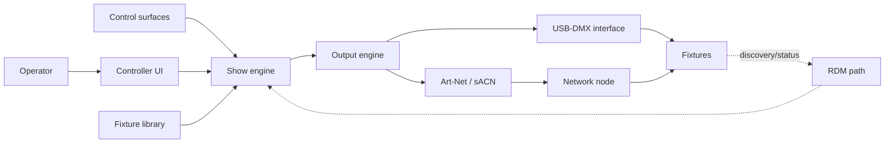

# System Context

## Objective

Translate user intent into deterministic lighting output while preserving a clear, editable show model and safe live controls.

The confirmed interface direction is React-based SaaS. The show/template/venue/programming domain is now specified in [[Domain Model]], with cross-layer feature contracts in [[../02 Product/Features/Feature Catalog]]. [[Service and Runtime Boundaries]] proposes cloud planning and a venue-local bridge for physical DMX/Art-Net output. The prototype implements simulated UI behavior only.

## Conceptual flow

This diagram describes responsibilities, not a committed process or deployment architecture.

## Candidate domains

- **Show document:** fixtures, patch, groups, palettes, scenes/cues, timelines, and mappings
- **Fixture library:** modes, channels, capabilities, ranges, units, and defaults
- **Evaluation engine:** combines active sources and computes parameter values over time
- **Output engine:** converts parameters to frames and schedules protocol transmission
- **Device layer:** discovers, opens, monitors, and recovers USB/network interfaces
- **Interaction layer:** editing, live playback, feedback, undo, and external controls
- **Persistence:** versioned, recoverable, portable show files and preferences

## Quality attributes to prove

| Attribute | Question to answer |
| --- | --- |
| Determinism | Does identical state and input produce identical output? |
| Timing | What frame rate, jitter, and input-to-output latency are acceptable and achievable? |
| Reliability | What happens on UI stalls, sleep, device disconnect, or network loss? |
| Safety | Can output be frozen, faded, blacked out, or restored predictably? |
| Recoverability | Can a show survive crashes and interrupted saves? |
| Portability | Can the same show target different compatible fixtures or interfaces? |
| Observability | Can developers and operators explain the current output value? |

## Architecture constraints not yet decided

- Supported desktop operating systems
- Local companion/bridge packaging and offline UI access (the primary SaaS UI is React)
- Single-process versus isolated real-time/output process
- Production backend/runtime language and React application architecture
- Fixture definition format and upstream data sources
- Show file format and compatibility policy
- Protocol and hardware libraries

Resolve these through [[../04 Research/R&D Backlog|research]] and record durable choices in [[../06 Decisions/Decision Index|decision records]].
